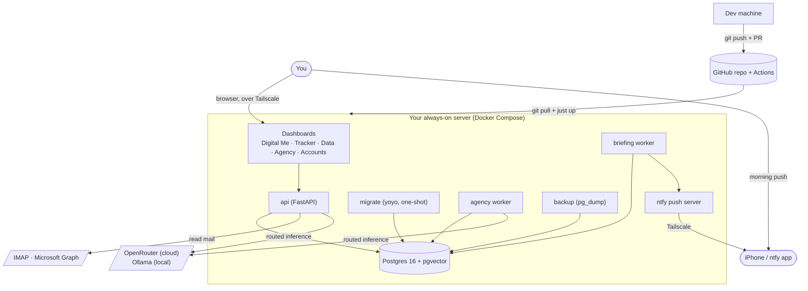
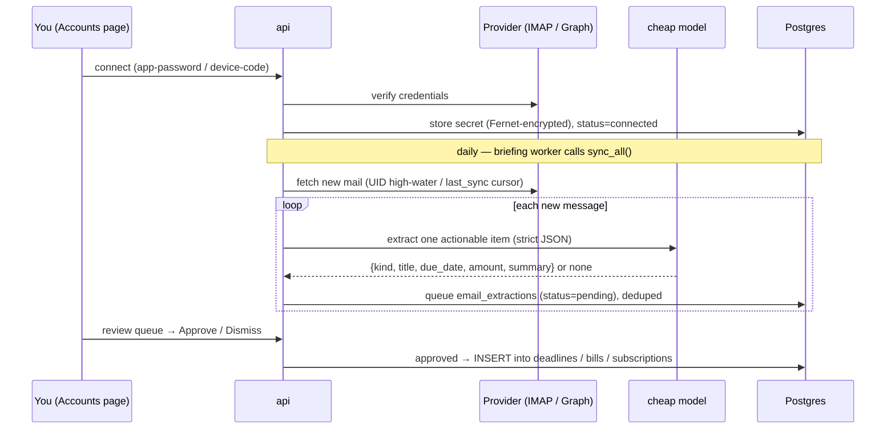
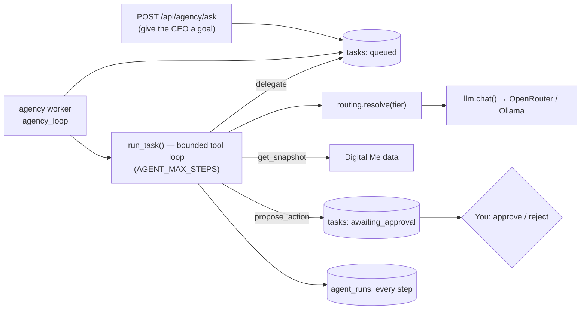

# Aadyon Assist — System Architecture

A self-hosted, multi-user **life-ops platform** with a conversational assistant. It keeps one
auditable source of truth for each user's deadlines, debts, bills, subscriptions, work and
income, immigration status, and goals — and layers four capabilities on top of it: a **Digital
Me** scoring model, an **agentic org** that reasons over that data, an **email ingest** pipeline
that turns inbox noise into reviewable to-dos, and an **Aadyon Assist chat assistant** that can act
on the user's own records. It runs on a stack (Postgres + Docker + Python) designed to move,
unchanged, between a dev machine and an always-on server.

> Design intent: the tool reflects your numbers; it does not move money or send mail on its own.
> Anything with a real-world side effect is gated behind explicit human approval.

---

## 1. Design principles

- **One source of truth.** Every view (tracker, Digital Me, briefing, agents) reads the same
  Postgres database. No metric is computed in two places.
- **Transparent over clever.** Scores return the sub-components they were built from; nothing is
  a black box you can't audit.
- **Read-by-default, write-on-approval.** Email sync and agents only *read* and *propose*;
  the assistant may edit the signed-in user's own records. Payments, emails, filings, and
  destructive actions never auto-execute.
- **Private by construction.** JWT auth + Postgres Row-Level Security isolate every user's data;
  a private Tailscale network adds defense-in-depth. Secrets live in Docker secrets; email
  credentials are encrypted at rest; personal data never enters git.
- **Port-later, not rewrite-later.** The schema and containers are identical on laptop and server.

---

## 2. Context diagram



The user reaches everything through a browser over Tailscale (or the iPhone app) and receives a
daily push on their phone. The whole application is a Docker Compose stack on one server. The
only outbound network calls are to mail providers (read-only) and model providers (inference).

---

## 3. Service topology

The stack is **seven containers** in `docker-compose.yml` (long-running ones
`restart: unless-stopped`):

| Service | Image / build | Role | Ports |
|---|---|---|---|
| **db** | `pgvector/pgvector:pg16` | Postgres + pgvector. `pg_isready` healthcheck. | internal |
| **migrate** | `code/api/Dockerfile` | One-shot: `yoyo apply` runs pending SQL migrations (ledger in `_yoyo_*` tables), then exits; the app services wait for it. | — |
| **api** | `code/api/Dockerfile` | FastAPI: REST API + serves dashboards. HTTP healthcheck on `/api/health`. | `${API_PORT:-8000}:8000` |
| **briefing** | same image | Runs `app.jobs.briefing_loop`: APScheduler cron writes `artifacts/briefing-*.md` and pushes to ntfy, daily at `BRIEFING_HOUR`. | — |
| **agency** | same image | Runs `app.jobs.agency_loop`: drains the agent task queue (CEO → teams). | — |
| **backup** | `prodrigestivill/postgres-backup-local:16` | Nightly gzipped `pg_dump` into `data/exports/daily/`, 14-day retention. `backup_sync.py` ships dumps to S3. | — |
| **ntfy** | `binwiederhier/ntfy` | Self-hosted push server. Private to the tailnet; `ntfy.sh` upstream only proxies the iOS background wake. | `${NTFY_PORT:-8090}:80` |

The DB password is supplied to `db`, `api`, `briefing`, `agency`, and `backup` via a **Docker
secret** (`secrets/db_password.txt`), never an environment variable. `api` and `agency` get
`host.docker.internal` mapped so they can reach a local **Ollama** on the host.

---

## 4. Application structure

The FastAPI app (`code/api/app/`) is layered, with absolute `app.*` imports:

```
app/
  main.py              create_app() — wires routers + mounts /static
  core/config.py       Settings: DB, secrets, artifacts, briefing hour, TZ,
                       model routing, ntfy, email (Fernet key, lookback), MS/Google OAuth
  db/session.py        psycopg2 connection pool + query() helper (RealDictCursor)
  models/tables.py     Entity registry — every CRUD table + its writable-column whitelist
  routers/
    system.py          /api/health, /api/summary, /api/digital-me, /api/entities, /api/briefing
    auth.py            /api/auth/* — signup, login, me + the get_current_user dependency
    crud.py            generic CRUD router factory (one router per Entity)
    agency.py          /api/agency/* — org, health, ask, tasks, runs, approvals
    email.py           /api/email/* — connect, sync, MS device-code, extractions review
    assistant.py       /api/assistant/* — conversations + chat (sync and SSE)
    dashboard.py       serves /, /tracker, /data, /agency, /accounts
  services/
    common.py          numeric helpers (f, clamp, rnd, band) + constants
    dimensions.py      life + income + financial/visa/career/goal read-models
    digital_me.py      orchestrator — assembles the dimensions into one payload
    summary.py         tracker read-model aggregation
    schema.py          column metadata (types, required, FKs) for the data admin
    briefing.py        builds the daily briefing markdown
    notify.py          push_briefing() → self-hosted ntfy
    routing.py         resolve(tier) → {provider, model, temperature} from model_routes
    llm.py             chat() via LiteLLM — OpenRouter (tool-calling) + Ollama (local); health()
    tools.py           - `assistant`: get_snapshot, get_calendar, get_transactions, get_document_extractions, get_recent_documents, read_document, [write tools for deadlines/bills/debts/subs/profile], propose_action (approval-gated externals)
    agency.py          org_tree(), ask_ceo(), run_task() — the bounded tool-calling engine
    assistant.py       the chat engine behind /api/assistant (history + tool loop)
    auth.py            password hashing + JWT mint/verify + signup (seed_org per user)
    crypto.py          Fernet encrypt/decrypt for stored email secrets
    email_extract.py   LLM extraction prompt + output normalization (coerce_due, normalize)
    email_store.py     dedup, queue pending extractions, apply approved ones
    email_imap.py      IMAP reading + iCloud/Gmail sync path
    email_graph.py     Microsoft Graph (Outlook/365) sync path
    email_ingest.py    entrypoint: dispatch per-account sync, sync_all, re-export helpers
    ms_graph.py        Graph device-code OAuth + mail fetch
    document_ingest.py PDF extraction (pypdf) + LLM vision parsing
    storage.py         S3 client (boto3) wrapper
  jobs/
    briefing_loop.py   briefing worker (own container)
    agency_loop.py     agent queue worker (own container)
    import_entities.py inbox importer (run via `just import`)
    backup_sync.py     syncs pg_dump archives to S3
```

**Generic CRUD.** `models/tables.py` declares each table as an `Entity(table, columns, order_by)`.
`routers/crud.py` turns each `Entity` into a full REST resource, with writes restricted to the
column whitelist (`id`, `created_at`, `updated_at` are DB-managed and never writable). The data
admin UI builds typed forms from `/api/entities`, which reads column types, nullability, and
foreign keys live from `information_schema` — so the admin stays in sync with the DB with zero
hardcoding.

The dashboards are vanilla HTML/JS, no build step. They share `dashboard/assets/base.css` (theme
tokens, reset, and common components) and `dashboard/assets/base.js` (helpers `esc`/`money`/
`money2`/`num`/`$`, plus `renderNav()` which renders the top nav consistently on every page).

---

## 5. Core data flows

### 5.1 Digital Me

`GET /api/digital-me` returns, in one response: the `profile` singleton, a *life-since-birth*
track (days alive, life-lived %, countdown to 30), projected income, and four **transparent
0–100 dimension scores** — Financial, Visa/Status, Career, Goal-by-30 — each returning the
sub-components it was computed from. The orchestrator (`digital_me.py`) composes read-models from
`dimensions.py`; shared math lives in `common.py`. Scores are deliberately honest: a near-limit
debt load or a job search that hasn't started reads low.

### 5.2 Tracker

`GET /api/summary` aggregates everything the Phase-1 tracker (`/tracker`) needs in one call:
deadlines, the `debt_summary` view, debt totals, active bills, active subscriptions, and recent
shifts.

### 5.3 Email ingest pipeline



Read-only over IMAP and Graph — nothing is ever deleted or sent. Each account tracks a cursor
(IMAP UID high-water + UIDVALIDITY; Graph `last_sync`) so a sync only spends model calls on new
mail. Stored secrets (IMAP app-passwords, Graph refresh tokens) are **Fernet-encrypted**.
Extractions are **never auto-applied** — they wait in a review queue. The extraction prompt is
tuned to ignore marketing, receipts, shipping, OTP/login alerts, and automated CI/notification
mail. Providers: iCloud and Gmail via IMAP app-password; Outlook/Microsoft 365 via Graph
device-code OAuth.

### 5.4 Agentic org



A **CEO** agent takes a goal, calls `get_snapshot` for real data, and **delegates** sub-tasks to
four **teams** (Finance, Immigration, Career, Growth — the four dimensions). Team leads and
employees analyze and, for anything with a side effect, call `propose_action`, which queues a
proposal in `awaiting_approval` — it does **not** execute. Every model turn and tool call is
logged to `agent_runs`. The loop is bounded by `AGENT_MAX_STEPS`. Tool access is by org level:
CEO gets `get_snapshot` + `delegate`; leads/employees get `get_snapshot` + `propose_action`.

**Model routing.** Each agent has a *tier* (`reasoning` / `cheap` / `local`). `routing.resolve()`
maps a tier to a concrete provider+model from the `model_routes` table (editable in the admin),
falling back to `config.default_routes`. Defaults: `reasoning → openrouter/auto`,
`cheap → openai/gpt-4o-mini`, `local → ollama/llama3.1`. One core (OpenRouter) fans out to many
cloud providers; Ollama serves the local tier. With no key present, agents route correctly but
tasks land in `blocked` with a clear message — nothing crashes.

### 5.5 Daily briefing & push

The `briefing` worker calls `build_briefing()` against the live DB, writes
`artifacts/briefing-YYYY-MM-DD.md` (+ `briefing-latest.md`), and `push_briefing()` POSTs it to the
self-hosted **ntfy** topic, which delivers to the phone over Tailscale. Content stays on the
tailnet; only the iOS background wake is proxied via `ntfy.sh` upstream. The same `build_briefing()`
backs `GET /api/briefing`.

---

## 6. Data model

Postgres 16 with the `pgvector` extension (vector columns reserved for future RAG memory).
Migrations live in `code/db/migrations/` and are applied by **yoyo-migrations** (the compose
`migrate` service; applied-state ledger in the `_yoyo_*` tables), in filename order:

`01_schema` · `03_digital_me` · `04_jobs_schedule` · `05_debts_emi` · `06_agency` ·
`07_email_accounts` · `08_email_ingest` · `09_email_uid` · `202607010711_multiuser_auth` ·
`202607010711_conversations` · (new ones via `just new-migration <name>`).

Personal seed data is **not** a migration: it lives in the gitignored `code/db/seed/` and is
applied with `just seed` (placeholder template: `code/db/seed.example.sql`).

Every table has DB-managed `id` (UUID), `created_at`, and `updated_at`.

**Life-ops core**

| Table | Purpose | Notable columns |
|---|---|---|
| `deadlines` | Dated to-dos (visa, payments, renewals) | title, category, due_date, status, priority, blocked_on |
| `debts` | Cards + installment/EMI debts | name, kind, balance, apr, min_payment, credit_limit, due_date, installment_amount, term_months, installments_paid, priority_rank |
| `bills` | Recurring bills | name, amount, frequency, due_day, autopay, category, active |
| `subscriptions` | Recurring subscriptions | name, amount, billing_cycle, renews_on, category, active |
| `shifts` | Individual work shifts | employer, role, shift_date, start/end_time, hours, hourly_rate, est_pay, status |
| `debt_summary` | **View**: per-debt utilization + interest | (derived from `debts`) |

**Digital Me**

| Table | Purpose | Notable columns |
|---|---|---|
| `profile` | Singleton identity + targets | full_name, birthdate, visa_type, visa_status, work_auth_until, target_role, target_salary, current_income, goal_title, goal_target_date, life_expectancy_years |
| `applications` | Job-search funnel | company, role, status, salary_min/max, work_type, source, applied_date |
| `milestones` | Life timeline + in-progress goals | title, category, milestone_date, achieved, progress_pct |

**Work & income**

| Table | Purpose | Notable columns |
|---|---|---|
| `jobs` | Part-time / full-time jobs | employer, role, kind, status, hourly_rate, annual_salary, remittance_pct, start/end_date |
| `work_schedule` | Weekly hours per job | **job_id → jobs**, day_of_week, start/end_time, hours, active |

**Email & Connectors (P2 / P3)**

| Table | Purpose | Notable columns |
|---|---|---|
| `email_accounts` | Mailbox registry + connection state | email, provider, auth_type, imap_host/port, status, **secret_enc** (Fernet), last_sync, last_uid, uid_validity, last_error |
| `email_extractions` | Review queue of extracted items | **account_id → email_accounts**, message_uid, message_date, sender, subject, kind, payload (JSON), summary, status (pending/approved/dismissed) |
| `documents` | PDFs and receipts (P3) | filename, mime_type, **storage_path** (S3 key), size_bytes |
| `document_extractions` | Review queue for parsed documents | **document_id → documents**, status, kind, payload |
| `calendar_accounts` | Google Calendar connections | email, provider, status, **secret_enc**, sync_token |
| `drive_accounts` | Google Drive connections | email, provider, status, **secret_enc**, page_token |
| `bank_accounts` | Plaid/Teller Banking accounts | inst_name, account_mask, type, balance, **secret_enc** |

**Agentic org**

| Table | Purpose | Notable columns |
|---|---|---|
| `teams` | The four teams | name, dimension, mission, active |
| `agents` | CEO/lead/employee org chart | name, title, agent_type, **team_id → teams**, **reports_to → agents**, model_tier, model_id, system_prompt, autonomy |
| `tasks` | Queue + proposals | title, description, kind (goal/task/proposal), **team_id**, **agent_id**, **parent_id**, status, requires_approval, result, error, model_used |
| `model_routes` | Tier → provider+model map | tier, provider, model_id, temperature, active |
| `agent_runs` | Per-step audit trail | **task_id**, **agent_id**, step, provider, model, role, tool_name, content, tokens |

---

## 7. API reference

**Pages** — `GET /` (Digital Me), `/tracker`, `/data`, `/agency`, `/accounts`, `/static/*`.

All `/api/*` routes below require an `Authorization: Bearer <jwt>` header **except** `/api/health`
and `/api/auth/*`. Data is scoped to the token's user by RLS.

**Auth**
- `POST /api/auth/signup` (`{email, password, display_name}`) → `{token, user}`; seeds the user's org.
- `POST /api/auth/login` (`{email, password}`) → `{token, user}`.
- `GET /api/auth/me` → the current user.

**Assistant (Aadyon Assist)**
- `POST /api/assistant/chat` (`{message, conversation_id?}`) → `{conversation_id, reply, actions, proposals}`.
- `POST /api/assistant/chat/stream` — SSE variant (streamed reply + terminal actions/proposals).
- `GET/POST /api/assistant/conversations` · `GET /api/assistant/conversations/{id}/messages`.

**System**
- `GET /api/health` — DB liveness (`ok` / `degraded`), public.
- `GET /api/summary` — full tracker payload in one response.
- `GET /api/digital-me` — identity + life track + four dimension scores.
- `GET /api/entities` — per-entity column metadata (types, required, FKs) from `information_schema`.
- `GET /api/briefing` — the current briefing markdown.

**CRUD** (generated per entity) — `GET/POST /api/{entity}`, `GET/PATCH/DELETE /api/{entity}/{id}`.

**Agency**
- `GET /api/agency/org` · `GET /api/agency/health` (key set? Ollama reachable? routes)
- `POST /api/agency/ask` (give the CEO a goal) · `GET /api/agency/tasks` · `GET /api/agency/runs`
- `POST /api/agency/tasks/{id}/run|approve|reject`

**Email & Documents**
- `POST /api/email/{account_id}/connect` (IMAP app-password) · `POST .../disconnect`
- `POST /api/email/{account_id}/ms/start` · `POST .../ms/complete` (Graph device-code)
- `POST /api/email/{account_id}/sync`
- `GET /api/email/extractions?status=` · `POST /api/email/extractions/{id}/approve|dismiss`
- `POST /api/documents` (upload file to S3) · `GET /api/documents/{id}/content`

---

## 8. Security model

- **Multi-user auth + database isolation.** The API requires a **JWT bearer token** (obtained from
  `POST /api/auth/login` or `/signup`; signed with the `jwt_secret` Docker secret). Every per-user
  table is isolated by **Postgres Row-Level Security**: the `get_current_user` dependency sets the
  request's user id on `app.current_user_id`, and each policy filters rows by it (fail-closed — an
  unset user sees zero rows). `/api/health` and `/api/auth/*` are the only public routes. Tailscale
  remains a strong second layer, but auth+RLS is the isolation contract, so cautious public exposure
  is possible. `db/session.py` sets the GUC per transaction (transaction-local, cleared each query);
  `query_unscoped()` is reserved for the non-RLS `users` table and global `model_routes`.
- **Action boundary.** The assistant writes the user's *own* records directly (create/update/delete
  deadlines, bills, debts, subscriptions, milestones, profile). External side effects — money, email,
  filings — still route through `propose_action` → `awaiting_approval` for explicit human sign-off.
- **Secrets via Docker secrets.** `db_password`, `jwt_secret`, `openrouter_api_key`, `email_key`,
  `s3_access_key`, and `s3_secret_key` are mounted from `secrets/` (preferred) with env-var fallback. Config reads secret files first, env second.
- **Email credentials encrypted at rest.** IMAP app-passwords and Graph refresh tokens are stored
  in `email_accounts.secret_enc`, encrypted with Fernet (`crypto.py`). Plaintext is held only
  transiently in memory during a sync.
- **Read-only external access.** Mail is read over IMAP/Graph with read-only scopes; agents and
  sync never delete or send. All side-effecting actions are human-approved.
- **Personal data never in git.** Seed data (`code/db/seed/`), DB dumps
  (`data/exports/`), `artifacts/`, and source documents are `.gitignore`d. The repo is private.

---

## 9. Deployment & operations

### 9.1 Topology

- **Server (production)** — an always-on Linux box running the full Compose stack, reachable
  over your tailnet. This is where the real data lives.
- **Dev machine** — same stack via `just up`; API on `localhost:8000`.

### 9.2 Deploy a change

History is **linear** (no force-push) so multiple agents can collaborate via branches + PRs.
Features land through a Pull Request gated by CI; a human merges to `main` and deploys.

```bash
# dev machine — feature branch, commit, push, open a PR; merge when CI is green
git checkout -b feat/<name> && git add -A && git commit && git push -u origin feat/<name>

# server — after the PR is merged, fast-forward and rebuild (migrations apply on up)
cd ~/aadyon-assist && git pull --ff-only \
  && docker compose up -d --build migrate api briefing agency
```

`.github/workflows/ci.yml` runs ruff + gitleaks + `pytest` + a build/smoke test with a
Schemathesis contract fuzz on every push and PR; `publish.yml` builds and pushes the API image
to GHCR. Deploy stays a human step — agents never auto-deploy to the shared server.

### 9.3 Schema migrations

Migrations are plain SQL files in `code/db/migrations/`, applied by **yoyo-migrations** with an
applied-state ledger in the database (`_yoyo_*` tables) — fresh volumes and live databases share
the same path. Create one with `just new-migration <name>` (timestamped, so parallel agents never
collide); apply with `just migrate` (also runs automatically on `just up`).

**Upgrading a pre-yoyo database (one-time baseline):** the existing schema was applied before the
ledger existed, so record it without re-executing:

```bash
just backup-now        # always dump first
just migrate-baseline  # yoyo mark: records all current files as applied
just migrate           # from now on applies only new files (this run is a no-op)
```

### 9.4 Backups & restore

The `backup` container (postgres-backup-local) writes gzipped dumps under
`data/exports/daily/` nightly with 14-day retention. On-demand: `just backup-now`.
Restore into a running stack:

```bash
just restore data/exports/daily/<file>.sql.gz
```

### 9.5 Routine actions

- **Connect a mailbox** — Accounts page → add account → Connect (IMAP app-password) or Connect
  (Microsoft device-code).
- **Sync email** — automatic each morning via the briefing worker, or per-account on the Accounts
  page; review the queue and Approve/Dismiss.
- **Run the org** — Agency page → "Ask the CEO" a goal; the worker fans it out; approve any
  proposals.
- **Turn agents on** — put `OPENROUTER_API_KEY` in `.env` (or `secrets/openrouter_api_key.txt`)
  and restart; optionally run Ollama on the host for the `local` tier.

---

## 10. Configuration reference

Set in `.env` (see `.env.example`); secrets preferred via files in `secrets/`.

| Variable | Purpose | Default |
|---|---|---|
| `API_PORT` | Host port for the API | 8000 (Mini-A 8800) |
| `TZ` / `BRIEFING_HOUR` | Timezone / daily briefing hour | `America/Phoenix` / 7 |
| `OPENROUTER_API_KEY` | Cloud model access (or `secrets/openrouter_api_key.txt`) | — |
| `OPENROUTER_BASE_URL` | OpenRouter endpoint | `https://openrouter.ai/api/v1` |
| `OLLAMA_BASE_URL` | Local model endpoint | `http://host.docker.internal:11434` |
| `AGENCY_WORKER_ENABLED` / `AGENT_MAX_STEPS` | Worker on/off / loop bound | `true` / 6 |
| `EMAIL_ENC_KEY` | Fernet key for email secrets (or `secrets/email_key`) | — |
| `EMAIL_LOOKBACK_DAYS` / `EMAIL_MAX_MESSAGES` | Sync window / cap | 14 / 40 |
| `MS_CLIENT_ID` / `MS_TENANT` | Microsoft Graph app | — / `common` |
| `GOOGLE_CLIENT_ID` / `GOOGLE_CLIENT_SECRET` | Gmail OAuth (IMAP used in practice) | — |
| `NTFY_TOPIC` / `NTFY_PORT` / `NTFY_BASE_URL` | Push topic / port / phone-facing URL | — / 8090 / — |
| `S3_ENDPOINT_URL` / `S3_BUCKET` | AWS S3 or MinIO bucket config | — / `aadyon-assist` |

---

*This document describes the architecture as built. For the day-one quickstart see
[README.md](README.md); for the Tailscale setup see [TAILSCALE.md](TAILSCALE.md).*
