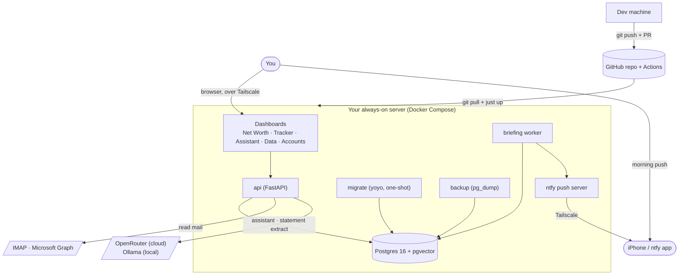
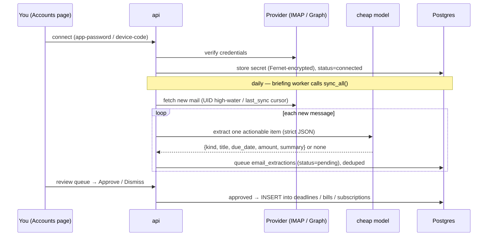

# Aadyon Assist — System Architecture

A self-hosted, multi-user **personal finance / net-worth app** with a conversational assistant.
It keeps one auditable source of truth for each user's **assets, debts, bills, subscriptions,
income, and transactions** — and layers three capabilities on top of it: a **net-worth** read
model (assets − liabilities, tracked over time), an **email/document ingest** pipeline that turns
statements and inbox noise into reviewable financial entries, and an **Aadyon Assist chat
assistant** that can act on the user's own records. It runs on a stack (Postgres + Docker +
Python) designed to move, unchanged, between a dev machine and an always-on server.

> Design intent: the tool reflects your numbers; it does not move money or send mail on its own.
> Anything with a real-world side effect is gated behind explicit human approval.

---

## 1. Design principles

- **One source of truth.** Every view (net worth, tracker, briefing, assistant) reads the same
  Postgres database. No figure is computed in two places.
- **Transparent over clever.** Net worth is a plain sum (assets − liabilities) with the breakdown
  returned alongside; nothing is a black box you can't audit.
- **Read-by-default, write-on-approval.** Email/document sync only *reads* and *proposes*;
  the assistant may edit the signed-in user's own records. Payments, emails, and destructive
  actions never auto-execute — they queue as `proposals`.
- **Private by construction.** JWT auth + Postgres Row-Level Security isolate every user's data;
  a private Tailscale network adds defense-in-depth. Secrets live in Docker secrets; email
  credentials are encrypted at rest; personal data never enters git.
- **Port-later, not rewrite-later.** The schema and containers are identical on laptop and server.

---

## 2. Context diagram

See [docs/architecture.md](docs/architecture.md) for the rendered system + service diagrams
([architecture.mermaid](architecture.mermaid) / [services-architecture.mermaid](services-architecture.mermaid)).


```mermaid
flowchart TD
  you([You]) -->|browser, over Tailscale| dash["Dashboards<br/>Net Worth · Tracker · Assistant · Data · Accounts"]
  you -->|morning push| phone([iPhone / ntfy app])

  subgraph host["Your always-on server (Docker Compose)"]
    dash --> api["api (FastAPI)"]
    api --> db[("Postgres 16 + pgvector")]
    migrate["migrate (yoyo, one-shot)"] --> db
    briefing["briefing worker"] --> db
    backup["backup (pg_dump)"] --> db
    ntfy["ntfy push server"]
    briefing --> ntfy
  end

  ntfy -->|Tailscale| phone
  api -->|read mail| mail[/"IMAP · Microsoft Graph"/]
  api -->|assistant · statement extract| models[/"OpenRouter (cloud)<br/>Ollama (local)"/]

  laptop["Dev machine"] -->|git push + PR| gh[("GitHub repo + Actions")]
  gh -->|git pull + just up| host
```

The user reaches everything through a browser over Tailscale (or the iPhone app) and receives a
daily push on their phone. The whole application is a Docker Compose stack on one server. The
only outbound network calls are to mail providers (read-only) and model providers (inference).

---

## 3. Service topology

The stack is **six containers** in `docker-compose.yml` (long-running ones
`restart: unless-stopped`):

| Service | Image / build | Role | Ports |
|---|---|---|---|
| **db** | `pgvector/pgvector:pg16` | Postgres + pgvector. `pg_isready` healthcheck. | internal |
| **migrate** | `code/api/Dockerfile` | One-shot: `yoyo apply` runs pending SQL migrations (ledger in `_yoyo_*` tables), then exits; the app services wait for it. | — |
| **api** | `code/api/Dockerfile` | FastAPI: REST API + serves dashboards. HTTP healthcheck on `/api/health`. | `${API_PORT:-8000}:8000` |
| **briefing** | same image | Runs `app.jobs.briefing_loop`: APScheduler cron writes `artifacts/briefing-*.md` and pushes to ntfy, daily at `BRIEFING_HOUR`. | — |
| **backup** | `prodrigestivill/postgres-backup-local:16` | Nightly gzipped `pg_dump` into `data/exports/daily/`, 14-day retention. `backup_sync.py` ships dumps to S3. | — |
| **ntfy** | `binwiederhier/ntfy` | Self-hosted push server. Private to the tailnet; `ntfy.sh` upstream only proxies the iOS background wake. | `${NTFY_PORT:-8090}:80` |

The DB password is supplied to `db`, `api`, `briefing`, and `backup` via a **Docker secret**
(`secrets/db_password.txt`), never an environment variable. `api` gets `host.docker.internal`
mapped so it can reach a local **Ollama** on the host.

---

## 4. Application structure

The FastAPI app (`code/api/app/`) is layered, with absolute `app.*` imports:

```
app/
  main.py              create_app() — wires routers + mounts /static
  core/config.py       Settings: DB, secrets, artifacts, briefing hour, TZ,
                       model routing, ntfy, email (Fernet key, lookback), MS/Google OAuth
  db/session.py        psycopg2 connection pool + query() helper (RealDictCursor)
  models/tables.py     Entity registry — every CRUD table + its writable-column whitelist
  routers/
    system.py          /api/health, /api/summary, /api/entities, /api/briefing
    auth.py            /api/auth/* — signup, login, me + the get_current_user dependency
    crud.py            generic CRUD router factory (one router per Entity)
    networth.py        /api/networth (summary), /api/networth/snapshot
    bank.py            /api/bank/* — accounts, transactions review, connect/sync
    email.py           /api/email/* — connect, sync, MS device-code, extractions review
    documents.py       /api/documents — upload + extraction review
    assistant.py       /api/assistant/* — conversations + chat (sync and SSE)
    dashboard.py       serves / (Net Worth), /tracker, /data, /assistant, /accounts
  services/
    common.py          numeric helpers (rnd, band, clamp) + constants
    networth.py        net_worth_summary() (assets − debts) + take_snapshot()
    summary.py         tracker read-model aggregation (debts/bills/subs/shifts)
    schema.py          column metadata (types, required, FKs) for the data admin
    briefing.py        builds the daily briefing markdown
    notify.py          push_briefing() → self-hosted ntfy
    routing.py         resolve(tier) → {provider, model, temperature} from config.default_routes
    llm.py             chat() via LiteLLM — OpenRouter (tool-calling) + Ollama (local); health()
    tools.py           assistant tools: get_snapshot (net worth), get_transactions,
                       get_document_extractions, read_document, [write tools for
                       assets/debts/bills/subs/profile], propose_action (approval-gated)
    assistant.py       the chat engine behind /api/assistant (history + tool loop)
    auth.py            password hashing + JWT mint/verify + signup (starter profile per user)
    crypto.py          Fernet encrypt/decrypt for stored email secrets
    bank_*.py          bank client / ingest / store (transactions → review queue)
    email_extract.py   LLM extraction prompt + output normalization (coerce_due, normalize)
    email_store.py     dedup, queue pending extractions, apply approved ones
    email_imap.py      IMAP reading + iCloud/Gmail sync path
    email_graph.py     Microsoft Graph (Outlook/365) sync path
    email_ingest.py    entrypoint: dispatch per-account sync, sync_all, re-export helpers
    ms_graph.py        Graph device-code OAuth + mail fetch; google_oauth.py — Gmail OAuth
    document_ingest.py PDF extraction (pypdf) + LLM vision parsing; document_store.py
    storage.py         S3-compatible client (boto3) wrapper — AWS or emulator by config
  jobs/
    briefing_loop.py   briefing worker (own container)
    import_entities.py inbox importer (run via `just import`)
    backup_sync.py     syncs pg_dump archives to S3
```

**Generic CRUD.** `models/tables.py` declares each table as an `Entity(table, columns, order_by)`.
`routers/crud.py` turns each `Entity` into a full REST resource, with writes restricted to the
column whitelist (`id`, `created_at`, `updated_at` are DB-managed and never writable). The data
admin UI builds typed forms from `/api/entities`, which reads column types, nullability, and
foreign keys live from `information_schema` — so the admin stays in sync with the DB with zero
hardcoding.

The dashboards are vanilla HTML/JS, no build step. They share `dashboard/assets/base.css` (theme
tokens, reset, and common components) and `dashboard/assets/base.js` (helpers `esc`/`money`/
`money2`/`num`/`$`, plus `renderNav()` which renders the top nav consistently on every page).

---

## 5. Core data flows

### 5.1 Net worth

`GET /api/networth` returns, in one response: total assets (sum of active `assets`), total
liabilities (sum of `debts`), **net worth = assets − liabilities**, a breakdown of assets by
kind, the individual holdings/debts, and the snapshot history. `POST /api/networth/snapshot`
records today's net worth into `net_worth_snapshots` (idempotent per user+day — a re-run
overwrites today), which powers the trend on the Net Worth dashboard (`/`). Math lives in
`services/networth.py`; no figure is computed in two places.

### 5.2 Tracker

`GET /api/summary` aggregates everything the tracker (`/tracker`) needs in one call:
deadlines, the `debt_summary` view, debt totals, active bills, active subscriptions, and recent
shifts.

### 5.3 Email ingest pipeline


```mermaid
sequenceDiagram
  participant U as You (Accounts page)
  participant API as api
  participant P as Provider (IMAP / Graph)
  participant LLM as cheap model
  participant DB as Postgres

  U->>API: connect (app-password / device-code)
  API->>P: verify credentials
  API->>DB: store secret (Fernet-encrypted), status=connected
  Note over API,DB: daily — briefing worker calls sync_all()
  API->>P: fetch new mail (UID high-water / last_sync cursor)
  loop each new message
    API->>LLM: extract one actionable item (strict JSON)
    LLM-->>API: {kind, title, due_date, amount, summary} or none
    API->>DB: queue email_extractions (status=pending), deduped
  end
  U->>API: review queue → Approve / Dismiss
  API->>DB: approved → INSERT into deadlines / bills / subscriptions
```

Read-only over IMAP and Graph — nothing is ever deleted or sent. Each account tracks a cursor
(IMAP UID high-water + UIDVALIDITY; Graph `last_sync`) so a sync only spends model calls on new
mail. Stored secrets (IMAP app-passwords, Graph refresh tokens) are **Fernet-encrypted**.
Extractions are **never auto-applied** — they wait in a review queue. The extraction prompt is
tuned to ignore marketing, receipts, shipping, OTP/login alerts, and automated CI/notification
mail. Providers: iCloud and Gmail via IMAP app-password; Outlook/Microsoft 365 via Graph
device-code OAuth.

### 5.4 Assistant & proposals

`services/assistant.py` runs a bounded tool-calling loop (`AGENT_MAX_STEPS`) over the routed
model. Read tools (`get_snapshot` → net worth, `get_transactions`, `get_document_extractions`,
`read_document`) run automatically; write tools (`create_/update_/delete_*` for
assets/debts/bills/subscriptions, `update_profile`) edit the signed-in user's **own** records
directly. Anything with a real-world **external** effect (moving money, sending email, paying a
bill) goes through `propose_action`, which inserts into the `proposals` table with
`status='pending'` and **does not execute** — the user approves later.

**Model routing.** The assistant routes by *tier* (`reasoning` / `cheap` / `local`).
`routing.resolve()` maps a tier to a concrete provider+model from `config.default_routes` (set in
the environment): `reasoning → openrouter/auto`, `cheap → openai/gpt-4o-mini`,
`local → ollama/llama3.1`. One core (OpenRouter) fans out to many cloud providers; Ollama serves
the local tier. With no key present, the chat replies with a clear message — nothing crashes.

### 5.5 Daily briefing & push

The `briefing` worker calls `build_briefing()` against the live DB, writes
`artifacts/briefing-YYYY-MM-DD.md` (+ `briefing-latest.md`), and `push_briefing()` POSTs it to the
self-hosted **ntfy** topic, which delivers to the phone over Tailscale. Content stays on the
tailnet; only the iOS background wake is proxied via `ntfy.sh` upstream. The same `build_briefing()`
backs `GET /api/briefing`.

---

## 6. Data model

Postgres 16 with the `pgvector` extension (vector columns reserved for future RAG memory).
Migrations live in `code/db/migrations/` and are applied by **yoyo-migrations** (the compose
`migrate` service; applied-state ledger in the `_yoyo_*` tables), in filename order:

`01_schema` → the email/multi-user/conversations migrations → `…networth_core` →
`…remove_visa_columns` → `…prune_nonfinancial` (which dropped the Digital-Me, agency, calendar,
and drive tables during the finance refocus) · (new ones via `just new-migration <name>`).
Earlier migrations that created since-dropped tables (`03_digital_me`, `06_agency`, …) remain in
the ledger as applied history.

Personal seed data is **not** a migration: it lives in the gitignored `code/db/seed/` and is
applied with `just seed` (placeholder template: `code/db/seed.example.sql`).

Every table has DB-managed `id` (UUID), `created_at`, and `updated_at`.

**Net worth & finance core**

| Table | Purpose | Notable columns |
|---|---|---|
| `assets` | Holdings (cash/investment/retirement/property/vehicle/crypto) | name, kind, institution, value, currency, as_of, active |
| `net_worth_snapshots` | Daily net-worth time series (one row / user / day) | snapshot_date, total_assets, total_liabilities, net_worth, currency |
| `debts` | Cards + installment/EMI debts (liabilities) | name, kind, balance, apr, min_payment, credit_limit, due_date, installment_amount, term_months, installments_paid, priority_rank |
| `bills` | Recurring bills | name, amount, frequency, due_day, autopay, category, active |
| `subscriptions` | Recurring subscriptions | name, amount, billing_cycle, renews_on, category, active |
| `deadlines` | Dated to-dos (payments, renewals) | title, category, due_date, status, priority, blocked_on |
| `debt_summary` | **View**: per-debt utilization + interest | (derived from `debts`) |
| `profile` | Per-user settings + context (singleton) | full_name, preferred_name, location, current_income, monthly_essential_expenses, goal_title, goal_target_date |
| `proposals` | Human-in-the-loop queue for external actions | title, detail, category, status (pending/approved/dismissed) |

**Work & income**

| Table | Purpose | Notable columns |
|---|---|---|
| `jobs` | Part-time / full-time jobs | employer, role, kind, status, hourly_rate, annual_salary, remittance_pct, start/end_date |
| `work_schedule` | Weekly hours per job | **job_id → jobs**, day_of_week, start/end_time, hours, active |

**Email & Connectors (P2 / P3)**

| Table | Purpose | Notable columns |
|---|---|---|
| `email_accounts` | Mailbox registry + connection state | email, provider, auth_type, imap_host/port, status, **secret_enc** (Fernet), last_sync, last_uid, uid_validity, last_error |
| `email_extractions` | Review queue of extracted items | **account_id → email_accounts**, message_uid, message_date, sender, subject, kind, payload (JSON), summary, status (pending/approved/dismissed) |
| `documents` | Uploaded statements + receipts | filename, mime_type, **storage_path** (S3 key), size_bytes |
| `document_extractions` | Review queue for parsed documents | **document_id → documents**, status, kind, payload |
| `bank_accounts` | Banking accounts | institution, status, active, balance |
| `bank_transactions` | Transactions → review queue | **account_id → bank_accounts**, transaction_id, date, amount, merchant, category, status |

---

## 7. API reference

**Pages** — `GET /` (Net Worth), `/tracker`, `/assistant`, `/data`, `/accounts`, `/static/*`.

All `/api/*` routes below require an `Authorization: Bearer <jwt>` header **except** `/api/health`
and `/api/auth/*`. Data is scoped to the token's user by RLS.

**Auth**
- `POST /api/auth/signup` (`{email, password, display_name}`) → `{token, user}`; seeds a starter profile.
- `POST /api/auth/login` (`{email, password}`) → `{token, user}`.
- `GET /api/auth/me` → the current user.

**Assistant (Aadyon Assist)**
- `POST /api/assistant/chat` (`{message, conversation_id?}`) → `{conversation_id, reply, actions, proposals}`.
- `POST /api/assistant/chat/stream` — SSE variant (streamed reply + terminal actions/proposals).
- `GET/POST /api/assistant/conversations` · `GET /api/assistant/conversations/{id}/messages`.

**Net worth**
- `GET /api/networth` — totals (assets, liabilities, net worth) + breakdown + history.
- `POST /api/networth/snapshot` — record today's net worth (idempotent per day).

**System**
- `GET /api/health` — DB liveness (`ok` / `degraded`), public.
- `GET /api/summary` — full tracker payload in one response.
- `GET /api/entities` — per-entity column metadata (types, required, FKs) from `information_schema`.
- `GET /api/briefing` — the current briefing markdown.

**CRUD** (generated per entity) — `GET/POST /api/{entity}`, `GET/PATCH/DELETE /api/{entity}/{id}`.

**Bank**
- `GET /api/bank/transactions` · `POST /api/bank/transactions/{id}/approve|dismiss`
- `POST /api/bank/{account_id}/connect|disconnect|sync`

**Email & Documents**
- `POST /api/email/{account_id}/connect` (IMAP app-password) · `POST .../disconnect`
- `POST /api/email/{account_id}/ms/start` · `POST .../ms/complete` (Graph device-code)
- `POST /api/email/{account_id}/sync`
- `GET /api/email/extractions?status=` · `POST /api/email/extractions/{id}/approve|dismiss`
- `POST /api/documents` (upload file to S3) · `GET /api/documents/{id}/content`

---

## 8. Security model

- **Multi-user auth + database isolation.** The API requires a **JWT bearer token** (obtained from
  `POST /api/auth/login` or `/signup`; signed with the `jwt_secret` Docker secret). Every per-user
  table is isolated by **Postgres Row-Level Security**: the `get_current_user` dependency sets the
  request's user id on `app.current_user_id`, and each policy filters rows by it (fail-closed — an
  unset user sees zero rows). `/api/health` and `/api/auth/*` are the only public routes. Tailscale
  remains a strong second layer, but auth+RLS is the isolation contract, so cautious public exposure
  is possible. `db/session.py` sets the GUC per transaction (transaction-local, cleared each query);
  `query_unscoped()` is reserved for the non-RLS `users` table.
- **Action boundary.** The assistant writes the user's *own* records directly (create/update/delete
  assets, debts, bills, subscriptions, deadlines, profile). External side effects — money, email,
  payments — still route through `propose_action` → the `proposals` queue for explicit human sign-off.
- **Secrets via Docker secrets.** `db_password`, `jwt_secret`, `openrouter_api_key`, `email_key`,
  `s3_access_key`, and `s3_secret_key` are mounted from `secrets/` (preferred) with env-var fallback. Config reads secret files first, env second.
- **Email credentials encrypted at rest.** IMAP app-passwords and Graph refresh tokens are stored
  in `email_accounts.secret_enc`, encrypted with Fernet (`crypto.py`). Plaintext is held only
  transiently in memory during a sync.
- **Read-only external access.** Mail is read over IMAP/Graph with read-only scopes; agents and
  sync never delete or send. All side-effecting actions are human-approved.
- **Personal data never in git.** Seed data (`code/db/seed/`), DB dumps
  (`data/exports/`), `artifacts/`, and source documents are `.gitignore`d. The repo is private.

---

## 9. Deployment & operations

### 9.1 Topology

- **Server (production)** — an always-on Linux box running the full Compose stack, reachable
  over your tailnet. This is where the real data lives.
- **Dev machine** — same stack via `just up`; API on `localhost:8000`.

### 9.2 Deploy a change

History is **linear** (no force-push) so multiple agents can collaborate via branches + PRs.
Features land through a Pull Request gated by CI; a human merges to `main` and deploys.

```bash
# dev machine — feature branch, commit, push, open a PR; merge when CI is green
git checkout -b feat/<name> && git add -A && git commit && git push -u origin feat/<name>

# server — after the PR is merged, fast-forward and rebuild (migrations apply on up)
cd ~/aadyon-assist && git pull --ff-only \
  && docker compose up -d --build migrate api briefing
```

`.github/workflows/ci.yml` runs ruff + gitleaks + `pytest` + a build/smoke test with a
Schemathesis contract fuzz on every push and PR; `publish.yml` builds and pushes the API image
to GHCR. Deploy stays a human step — agents never auto-deploy to the shared server.

### 9.3 Schema migrations

Migrations are plain SQL files in `code/db/migrations/`, applied by **yoyo-migrations** with an
applied-state ledger in the database (`_yoyo_*` tables) — fresh volumes and live databases share
the same path. Create one with `just new-migration <name>` (timestamped, so parallel agents never
collide); apply with `just migrate` (also runs automatically on `just up`).

**Upgrading a pre-yoyo database (one-time baseline):** the existing schema was applied before the
ledger existed, so record it without re-executing:

```bash
just backup-now        # always dump first
just migrate-baseline  # yoyo mark: records all current files as applied
just migrate           # from now on applies only new files (this run is a no-op)
```

### 9.4 Backups & restore

The `backup` container (postgres-backup-local) writes gzipped dumps under
`data/exports/daily/` nightly with 14-day retention. On-demand: `just backup-now`.
Restore into a running stack:

```bash
just restore data/exports/daily/<file>.sql.gz
```

### 9.5 Routine actions

- **Connect a mailbox** — Accounts page → add account → Connect (IMAP app-password) or Connect
  (Microsoft device-code).
- **Sync email** — automatic each morning via the briefing worker, or per-account on the Accounts
  page; review the queue and Approve/Dismiss.
- **Ask the assistant** — Assistant page → chat; it reads your net worth and can update your own
  records; external actions queue as proposals for your approval.
- **Turn the assistant on** — put `OPENROUTER_API_KEY` in `.env` (or `secrets/openrouter_api_key.txt`)
  and restart; optionally run Ollama on the host for the `local` tier.

---

## 10. Configuration reference

Set in `.env` (see `.env.example`); secrets preferred via files in `secrets/`.

| Variable | Purpose | Default |
|---|---|---|
| `API_PORT` | Host port for the API | 8000 (Mini-A 8800) |
| `TZ` / `BRIEFING_HOUR` | Timezone / daily briefing hour | `America/Phoenix` / 7 |
| `OPENROUTER_API_KEY` | Cloud model access (or `secrets/openrouter_api_key.txt`) | — |
| `OPENROUTER_BASE_URL` | OpenRouter endpoint | `https://openrouter.ai/api/v1` |
| `OLLAMA_BASE_URL` | Local model endpoint | `http://host.docker.internal:11434` |
| `AGENCY_WORKER_ENABLED` / `AGENT_MAX_STEPS` | Worker on/off / loop bound | `true` / 6 |
| `EMAIL_ENC_KEY` | Fernet key for email secrets (or `secrets/email_key`) | — |
| `EMAIL_LOOKBACK_DAYS` / `EMAIL_MAX_MESSAGES` | Sync window / cap | 14 / 40 |
| `MS_CLIENT_ID` / `MS_TENANT` | Microsoft Graph app | — / `common` |
| `GOOGLE_CLIENT_ID` / `GOOGLE_CLIENT_SECRET` | Gmail OAuth (IMAP used in practice) | — |
| `NTFY_TOPIC` / `NTFY_PORT` / `NTFY_BASE_URL` | Push topic / port / phone-facing URL | — / 8090 / — |
| `S3_ENDPOINT_URL` / `S3_BUCKET` | AWS S3 or MinIO bucket config | — / `aadyon-assist` |

---

*This document describes the architecture as built. For the day-one quickstart see
[README.md](README.md); for the Tailscale setup see [TAILSCALE.md](TAILSCALE.md).*
