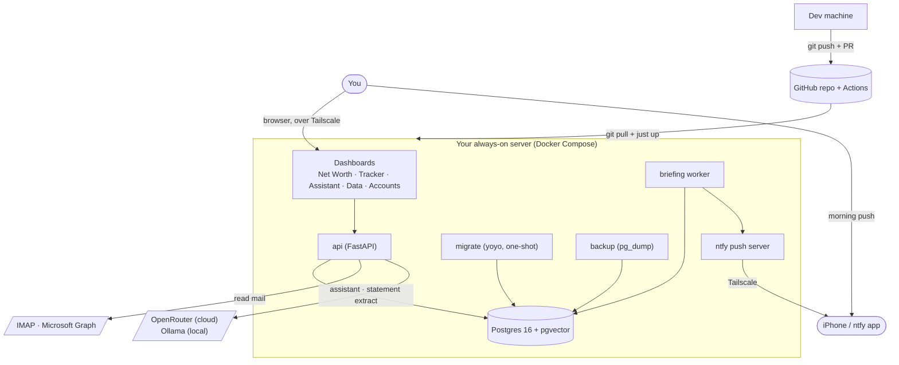
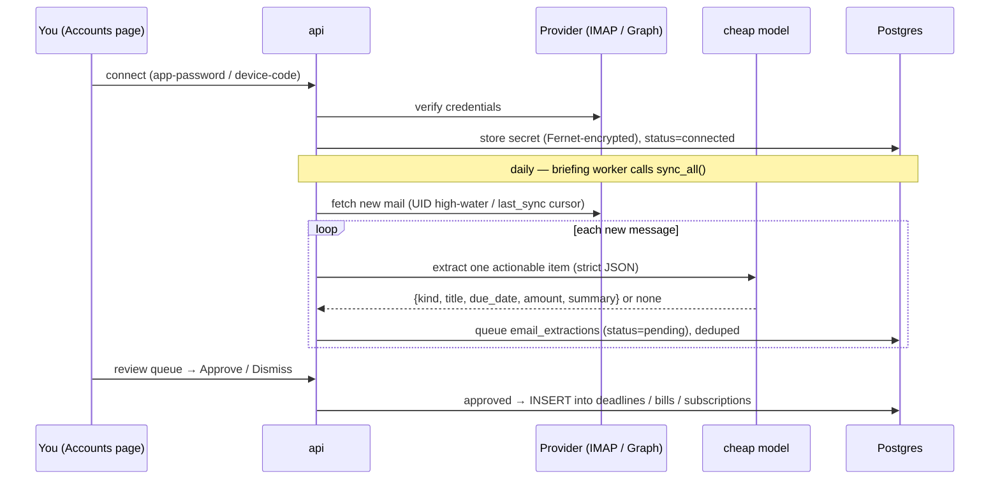

# Aadyon Assist — System Design

A self-hosted, multi-user **personal finance / net-worth app** with a conversational assistant.
It keeps one auditable source of truth for each user's **assets, debts, bills, subscriptions,
income, and transactions** — and layers three capabilities on top of it: a **net-worth** read
model (assets − liabilities, tracked over time), an **email/document ingest** pipeline that turns
statements and inbox noise into reviewable financial entries, and an **Aadyon Assist chat
assistant** that can act on the user's own records. It runs on a stack (Postgres + Docker +
Python) designed to move, unchanged, between a dev machine, an always-on home server, and a
managed cloud platform.

> Design intent: the tool reflects your numbers; it does not move money or send mail on its own.
> Anything with a real-world side effect is gated behind explicit human approval.

---

## 1. Requirements

### 1.1 Functional

- Track **net worth** (assets − liabilities) with a breakdown by asset type and a historical
  trend (`net_worth_snapshots`, one row per user per day).
- Track cash flow: **debts** (payoff order, interest math), **bills**, **subscriptions**,
  **deadlines**, and **income** (jobs + shifts).
- **Multi-user**, each account's data isolated from every other account's.
- A **conversational assistant** that reads a user's real numbers (never invents them), can
  directly create/update/delete that user's own financial records, and can **propose** — but
  never execute — anything with a real-world external effect (a payment, an email, a filing).
- **Ingestion**: read-only email sync (IMAP / Gmail / Microsoft Graph) and document upload
  (statements, receipts), both extracting candidate financial entries into a **human-reviewed
  queue** — nothing is auto-applied.
- A **daily briefing** (Markdown) summarizing deadlines, bills due, debt/interest totals, and
  pending proposals, pushed to the user's phone.
- A **generic data-admin UI** so every entity is viewable/editable without hand-written screens.
- **Portability**: the same containers and schema run on a laptop, a home server, or a managed
  cloud database/object store, with no code change (see [CLOUD.md](CLOUD.md),
  [cloud-storage.md](cloud-storage.md)).

### 1.2 Non-functional

- **Privacy and data ownership first.** The user's financial data lives on infrastructure they
  control. No telemetry, no third-party analytics, no ad tech.
- **Auditability over automation.** Every number the app shows must be traceable to a query the
  user (or a reviewer) can read; nothing is a black box.
- **Human-in-the-loop for anything irreversible.** External side effects are proposed, never
  executed, regardless of how confident the assistant is.
- **Low operational burden.** One person (or an AI agent acting on their behalf) should be able
  to run and maintain this — no dedicated ops team, no Kubernetes.
- **Small-scale load.** Designed for **personal or family-and-friends use** (single-digit to
  low-tens of accounts per instance), not internet-scale traffic. See §4 for what that implies.
- **Portable, not rewritten.** Dev, self-hosted prod, and a future managed-cloud deployment share
  one codebase and one schema (`docker-compose.dev.yml` is an additive overlay, never a fork).

### 1.3 Constraints

- Built and maintained by **a solo owner plus AI coding agents** (Claude, others) collaborating
  through Git — see `AGENTS.md` for the handoff protocol. This shapes several choices below:
  favor code that's easy for an agent with no prior context to reason about (generic CRUD from
  one registry, plain-SQL migrations, no framework magic) over choices that are more "correct" at
  scale but harder to onboard into cold.
- **Docker Compose**, not an orchestrator — one always-on box or one dev machine, not a cluster.
- **Single-node Postgres** — no read replica, no managed HA today (see §4.3).
- Budget-conscious: self-hosted by default; cloud is opt-in and pay-as-you-go (S3-compatible
  storage, optional managed Postgres).

---

## 2. High-level design

### 2.1 Context diagram

See [architecture.md](architecture.md) for the rendered diagrams
([architecture.mermaid](architecture.mermaid) / [services-architecture.mermaid](services-architecture.mermaid)).



The user reaches everything through a browser over Tailscale. The whole application is a Docker
Compose stack on one server. The only outbound network calls are to mail providers (read-only)
and model providers (inference).

### 2.2 Service topology

The stack is **six containers** in `docker-compose.yml` (long-running ones
`restart: unless-stopped`):

| Service | Image / build | Role | Ports |
|---|---|---|---|
| **db** | `pgvector/pgvector:pg16` | Postgres + pgvector. `pg_isready` healthcheck. | internal |
| **migrate** | `code/api/Dockerfile` | One-shot: `yoyo apply` runs pending SQL migrations (ledger in `_yoyo_*` tables), then exits; the app services wait for it. | — |
| **api** | `code/api/Dockerfile` | FastAPI: REST API + serves dashboards. HTTP healthcheck on `/api/health`. | `${API_PORT:-8000}:8000` |
| **briefing** | same image | Runs `app.jobs.briefing_loop`: APScheduler cron writes `artifacts/briefing-*.md` and pushes to ntfy, daily at `BRIEFING_HOUR`. | — |
| **backup** | `prodrigestivill/postgres-backup-local:16` | Nightly gzipped `pg_dump` into `data/exports/daily/`, 14-day retention. `backup_sync.py` ships dumps to S3. | — |
| **ntfy** | `binwiederhier/ntfy` | Self-hosted push server. Private to the tailnet; `ntfy.sh` upstream only proxies the iOS background wake. | `${NTFY_PORT:-8090}:80` |

`api`, `migrate`, and `briefing` are **the same image** with different entrypoints — a modular
monolith with sidecar workers, not independent microservices (see §5.1 trade-off). The DB
password is supplied to `db`, `api`, `briefing`, and `backup` via a **Docker secret**
(`secrets/db_password.txt`), never an environment variable. `api` gets `host.docker.internal`
mapped so it can reach a local **Ollama** on the host.

### 2.3 Application structure

The FastAPI app (`code/api/app/`) is layered, with absolute `app.*` imports:

```
app/
  main.py              create_app() — wires routers + mounts /static
  core/config.py       Settings: DB, secrets, storage, briefing hour, TZ,
                       model routing, ntfy, email (Fernet key, lookback), MS/Google OAuth
  db/session.py        psycopg2 pool + query()/query_unscoped() helpers (RLS-scoped)
  models/tables.py     Entity registry — every generic-CRUD table + its writable columns
  routers/
    system.py          /api/health, /api/summary, /api/entities, /api/briefing
    auth.py            /api/auth/* — signup, login, me + the get_current_user dependency
    crud.py            generic CRUD router factory (one router per Entity)
    networth.py        /api/networth (summary), /api/networth/snapshot
    bank.py            /api/bank/* — accounts, transactions review, connect/sync
    email.py           /api/email/* — connect, sync, MS/Google OAuth, extractions review
    documents.py       /api/documents — upload + extraction review
    assistant.py       /api/assistant/* — conversations + chat (sync and SSE)
    dashboard.py       serves / (Net Worth), /tracker, /data, /assistant, /accounts, /login
  services/
    common.py          numeric helpers (rnd, band, clamp) + constants
    networth.py        net_worth_summary() (assets − debts) + take_snapshot()
    summary.py         tracker read-model aggregation (debts/bills/subs/shifts)
    schema.py          column metadata (types, required, FKs) for the data admin
    briefing.py        builds the daily briefing markdown
    notify.py          push_briefing() → self-hosted ntfy
    routing.py         resolve(tier) → {provider, model, temperature} from config.default_routes
    llm.py             chat() via LiteLLM — OpenRouter (tool-calling) + Ollama (local); health()
    tools.py           assistant tools: get_snapshot (net worth), get_transactions,
                       get_document_extractions, read_document, [write tools for
                       assets/debts/bills/subs/profile], propose_action (approval-gated)
    assistant.py       the chat engine behind /api/assistant (history + bounded tool loop)
    auth.py            password hashing + JWT mint/verify + signup (starter profile per user)
    ratelimit.py        in-memory fixed-window limiter for the auth endpoints
    usage.py           per-user monthly LLM token budget enforcement
    crypto.py          Fernet encrypt/decrypt for stored email secrets
    bank_*.py          bank client / ingest / store (transactions → review queue)
    email_extract.py   LLM extraction prompt + output normalization (coerce_due, normalize)
    email_store.py     dedup, queue pending extractions, apply approved ones
    email_imap.py      IMAP reading + iCloud/Gmail sync path
    email_graph.py     Microsoft Graph (Outlook/365) sync path
    email_ingest.py    entrypoint: dispatch per-account sync, sync_all, re-export helpers
    ms_graph.py         Graph device-code OAuth + mail fetch; google_oauth.py — Gmail OAuth
    document_ingest.py PDF extraction (pypdf) + LLM vision parsing; document_store.py
    storage.py          S3-compatible client (boto3) wrapper — AWS or emulator by config
    mailer.py           transactional email (Resend-style; logs to stdout with no key)
    alerts.py            proactive "what needs attention" digest (deadlines/bills window)
  jobs/
    briefing_loop.py   briefing worker (own container)
    import_entities.py inbox importer (run via `just import`)
    backup_sync.py     syncs pg_dump archives to S3
```

**Generic CRUD.** `models/tables.py` declares each table as an `Entity(table, columns, order_by)`.
`routers/crud.py` turns each `Entity` into a full REST resource, with writes restricted to the
column whitelist (`id`, `created_at`, `updated_at` are DB-managed and never writable). The data
admin UI builds typed forms from `/api/entities`, which reads column types, nullability, and
foreign keys live from `information_schema` — so the admin stays in sync with the DB with zero
hardcoding. Not every table goes through this registry — `users`, `conversations`, `messages`,
and `memory_chunks` are managed by dedicated service code (auth, assistant) that
needs behavior the generic factory doesn't provide (password hashing, JWT minting, the tool
loop) — see §3.1.

The dashboards are vanilla HTML/JS, no build step. They share `dashboard/assets/base.css` (theme
tokens, reset, common components) and `dashboard/assets/base.js` (helpers `esc`/`money`/`money2`/
`num`/`$`, `fetchApi()` for bearer-token fetches, and `renderNav()` which renders the top nav
consistently on every page from one `NAV_LINKS` list).

### 2.4 Core data flows

**Net worth.** `GET /api/networth` returns, in one response: total assets (sum of active
`assets`), total liabilities (sum of `debts`), **net worth = assets − liabilities**, a breakdown
of assets by kind, the individual holdings/debts, and the snapshot history. `POST
/api/networth/snapshot` records today's net worth into `net_worth_snapshots` (idempotent per
user+day — a re-run overwrites today), which powers the trend on the Net Worth dashboard (`/`).
Math lives in `services/networth.py`; no figure is computed in two places.

**Tracker.** `GET /api/summary` aggregates everything the tracker (`/tracker`) needs in one call:
deadlines, the `debt_summary` view, debt totals, active bills, active subscriptions, and recent
shifts.

**Email ingest pipeline:**



Read-only over IMAP and Graph — nothing is ever deleted or sent. Each account tracks a cursor
(IMAP UID high-water + UIDVALIDITY; Graph `last_sync`) so a sync only spends model calls on new
mail. Stored secrets (IMAP app-passwords, Graph refresh tokens) are **Fernet-encrypted**.
Extractions are **never auto-applied** — they wait in a review queue. The extraction prompt is
tuned to ignore marketing, receipts, shipping, OTP/login alerts, and automated CI/notification
mail. Providers: iCloud and Gmail via IMAP app-password; Outlook/Microsoft 365 via Graph
device-code OAuth; Gmail also via OAuth.

**Assistant & proposals.** `services/assistant.py` runs a bounded tool-calling loop
(`AGENT_MAX_STEPS`) over the routed model. Read tools (`get_snapshot` → net worth,
`get_transactions`, `get_document_extractions`, `read_document`) run automatically; write tools
(`create_/update_/delete_*` for assets/debts/bills/subscriptions, `update_profile`) edit the
signed-in user's **own** records directly. Anything with a real-world **external** effect (moving
money, sending email, paying a bill) goes through `propose_action`, which inserts into the
`proposals` table with `status='pending'` and **does not execute** — the user approves later.

*Model routing.* The assistant routes by *tier* (`reasoning` / `cheap` / `local`).
`routing.resolve()` maps a tier to a concrete provider+model from `config.default_routes` (set in
the environment): `reasoning → openrouter/auto`, `cheap → openai/gpt-4o-mini`,
`local → ollama/llama3.1`. One core (OpenRouter) fans out to many cloud providers; Ollama serves
the local tier. With no key present, the chat replies with a clear message — nothing crashes.

**Daily briefing & push.** The `briefing` worker calls `build_briefing()` against the live DB,
writes `artifacts/briefing-YYYY-MM-DD.md` (+ `briefing-latest.md`), and `push_briefing()` POSTs it
to the self-hosted **ntfy** topic, which delivers to the phone over Tailscale. Content stays on
the tailnet; only the iOS background wake is proxied via `ntfy.sh` upstream. The same
`build_briefing()` backs `GET /api/briefing`.

---

## 3. Deep dive

### 3.1 Data model

Postgres 16 with the `pgvector` extension (vector columns reserved for assistant long-term memory
— see `memory_chunks` below). Migrations live in `code/db/migrations/` and are applied by
**yoyo-migrations** (the compose `migrate` service; applied-state ledger in the `_yoyo_*` tables).
As of the finance refocus, the schema is a single **consolidated baseline**
(`01_schema.sql`, regenerated from the live schema — see §7.3); new migrations are added on top
with `just new-migration <name>`.

Personal seed data is **not** a migration: it lives in the gitignored `code/db/init/` and is
supplied per-deployment. Every application table has DB-managed `id` (UUID), `created_at`, and
`updated_at`.

**Identity & auth** *(not per-user by definition — `users` is the one global, non-RLS table in
the schema, accessed via `query_unscoped()`)*

| Table | Purpose | Notable columns |
|---|---|---|
| `users` | Accounts | email, password_hash, display_name, email_verified, ntfy_topic, monthly_token_budget, tokens_used, usage_period_start |

**Net worth & finance core**

| Table | Purpose | Notable columns |
|---|---|---|
| `assets` | Holdings (cash/investment/retirement/property/vehicle/crypto) | name, kind, institution, value, currency, as_of, active |
| `net_worth_snapshots` | Daily net-worth time series (one row / user / day) | snapshot_date, total_assets, total_liabilities, net_worth, currency |
| `debts` | Cards + installment/EMI debts (liabilities) | name, kind, balance, apr, min_payment, credit_limit, due_date, installment_amount, term_months, installments_paid, priority_rank |
| `bills` | Recurring bills | name, amount, frequency, due_day, autopay, category, active |
| `subscriptions` | Recurring subscriptions | name, amount, billing_cycle, renews_on, category, active |
| `deadlines` | Dated to-dos (payments, renewals) | title, category, due_date, status, priority, blocked_on |
| `debt_summary` | **View** (`security_invoker`): per-debt utilization + interest | (derived from `debts`) |
| `profile` | Per-user settings + context (singleton) | full_name, preferred_name, location, current_income, monthly_essential_expenses, goal_title, goal_target_date |
| `proposals` | Human-in-the-loop queue for external actions | title, detail, category, status (pending/approved/dismissed) |

**Work & income**

| Table | Purpose | Notable columns |
|---|---|---|
| `jobs` | Part-time / full-time jobs | employer, role, kind, status, hourly_rate, annual_salary, remittance_pct, start/end_date |
| `work_schedule` | Weekly hours per job | **job_id → jobs**, day_of_week, start/end_time, hours, active |
| `shifts` | Individual worked shifts | employer, role, shift_date, start/end_time, hours, hourly_rate, est_pay, status |

**Assistant & memory** *(RLS-isolated, but not exposed via generic CRUD — owned by `services/assistant.py`)*

| Table | Purpose | Notable columns |
|---|---|---|
| `conversations` | Chat threads | title, updated_at (sort order for the sidebar) |
| `messages` | Turn-by-turn history | **conversation_id → conversations**, role, content, tool_calls (JSONB), tool_call_id, tool_name |
| `memory_chunks` | Durable facts the assistant remembers across sessions | source, content, **embedding vector(1536)** (pgvector; reserved — not yet used for similarity search), metadata (JSONB) |

**Email, Documents & Banking**

| Table | Purpose | Notable columns |
|---|---|---|
| `email_accounts` | Mailbox registry + connection state | email, provider, auth_type, imap_host/port, status, **secret_enc** (Fernet), last_sync, last_uid, uid_validity, last_error |
| `email_extractions` | Review queue of extracted items | **account_id → email_accounts**, message_uid, message_date, sender, subject, kind, payload (JSON), summary, status (pending/approved/dismissed) |
| `documents` | Uploaded statements + receipts | filename, mime_type, **storage_path** (S3 key), size_bytes |
| `document_extractions` | Review queue for parsed documents | **document_id → documents**, status, kind, payload |
| `bank_accounts` | Banking accounts | institution, status, active, balance |
| `bank_transactions` | Transactions → review queue | **account_id → bank_accounts**, transaction_id, date, amount, merchant, category, status |

### 3.2 API design

**Pages** — `GET /` (Net Worth), `/tracker`, `/assistant`, `/data`, `/accounts`, `/login`, `/static/*`.

All `/api/*` routes below require an `Authorization: Bearer <jwt>` header **except** `/api/health`
and `/api/auth/*`. Data is scoped to the token's user by RLS. There is no versioning prefix
(`/api/v1/...`) — a deliberate small-scale choice; see §5.

**Auth**
- `POST /api/auth/signup` (`{email, password, display_name}`) → `{token, user}`; seeds a starter profile.
- `POST /api/auth/login` (`{email, password}`) → `{token, user}`.
- `GET /api/auth/me` → the current user.

**Assistant (Aadyon Assist)**
- `POST /api/assistant/chat` (`{message, conversation_id?}`) → `{conversation_id, reply, actions, proposals}`.
- `POST /api/assistant/chat/stream` — SSE variant (streamed reply + terminal actions/proposals).
- `GET/POST /api/assistant/conversations` · `GET /api/assistant/conversations/{id}/messages`.

**Net worth**
- `GET /api/networth` — totals (assets, liabilities, net worth) + breakdown + history.
- `POST /api/networth/snapshot` — record today's net worth (idempotent per day).

**System**
- `GET /api/health` — DB liveness (`ok` / `degraded`), public.
- `GET /api/summary` — full tracker payload in one response.
- `GET /api/entities` — per-entity column metadata (types, required, FKs) from `information_schema`.
- `GET /api/briefing` — the current briefing markdown.

**CRUD** (generated per entity) — `GET/POST /api/{entity}`, `GET/PATCH/DELETE /api/{entity}/{id}`.

**Bank**
- `GET /api/bank/transactions` · `POST /api/bank/transactions/{id}/approve|dismiss`
- `POST /api/bank/{account_id}/connect|disconnect|sync`

**Email & Documents**
- `POST /api/email/{account_id}/connect` (IMAP app-password) · `POST .../disconnect`
- `POST /api/email/{account_id}/ms/start` · `POST .../ms/complete` (Graph device-code)
- `POST /api/email/{account_id}/sync`
- `GET /api/email/extractions?status=` · `POST /api/email/extractions/{id}/approve|dismiss`
- `POST /api/documents` (upload file to S3) · `GET /api/documents/{id}/content`

### 3.3 Caching strategy

**There is none, deliberately.** Every read hits Postgres directly through the pooled `query()`
helper. At the target scale (§4.1) the read volume is trivial for Postgres to serve uncached, and
a cache layer would add invalidation complexity (net worth, for instance, depends on both `assets`
and `debts` — a cache would need to know to invalidate on either write) for no measurable benefit
today. **Revisit if:** dashboard read latency becomes noticeable under real load, or the instance
serves enough concurrent users that repeated `net_worth_summary()` aggregation queries show up in
`pg_stat_statements` — at that point, a short-TTL cache keyed by `(user_id, endpoint)` in front of
`/api/networth` and `/api/summary` is the natural first move (see §6).

### 3.4 Queue / event design

**There is no message broker.** Two different mechanisms cover what would otherwise be queue use
cases, and neither is a queue in the Celery/RQ/SQS sense:

- **Scheduled work** (daily briefing, email sync) is a single in-process **APScheduler cron**
  inside the `briefing` container — not a distributed task queue. It runs once per instance;
  there is nothing to coordinate across workers because there is only one.
- **Human-in-the-loop actions** (`proposals`, `*_extractions`) are a **status-column state
  machine** (`pending` → `approved`/`dismissed`), not a message queue — there's no consumer
  draining it, only a human reviewing it in the UI at their own pace.

This keeps the deployment to Postgres + one process family, which matters for the "one person can
run this" constraint (§1.3). **Revisit if:** background work needs to fan out across multiple
workers, needs at-least-once delivery guarantees, or needs to survive a container restart
mid-job — at that point a lightweight queue (e.g. a Postgres-backed job table with `SELECT ... FOR
UPDATE SKIP LOCKED`, avoiding a new infra dependency) is the natural next step before reaching for
Redis/RabbitMQ.

### 3.5 Error handling & retry

- **DB connection errors** (`db/session.py:query()`) retry once transparently — a dropped
  connection (idle timeout, managed-Postgres failover) doesn't surface as a user-facing 500 on
  the first retry.
- **The assistant's tool loop is bounded** (`AGENT_MAX_STEPS`, default 6) — a model that keeps
  calling tools without producing a final answer terminates with a clear "ran out of room"
  message instead of looping forever or timing out the request.
- **A failing tool never crashes the chat.** `tools.dispatch()` catches every exception from a
  tool call and returns `{"error": ...}` as the tool result, so the model sees the failure and can
  react to it (or apologize) instead of the request 500ing mid-stream.
- **The briefing worker isolates each step.** Email sync, the write, and the backup-sync call are
  each wrapped in their own `try/except` — a broken mailbox integration logs an error but still
  lets the briefing get written and pushed.
- **Rate limiting is explicit about its own limits.** `services/ratelimit.py` is an in-memory,
  single-process fixed-window limiter on the auth endpoints — its own docstring names the
  trade-off: "Single-instance only… when the API runs as more than one replica, swap the backing
  store for Redis behind the same `hit()` signature." This is the clearest example in the codebase
  of a choice made for today's scale with the upgrade path already documented at the point of use.
- **Migrations are transactional.** Each migration file runs as one transaction (`-- transaction`
  directive); a failure mid-file rolls back cleanly rather than leaving the schema half-applied.

---

## 4. Scale and reliability

### 4.1 Load estimate

This is **not** an internet-scale system, by design (§1.2). The realistic target is:

- **Users per instance:** single-digit to low tens (one person, or family-and-friends).
- **Request pattern:** bursty and human-paced — dashboard loads, a chat message every few
  seconds during active use, background syncs once or twice a day. No sustained high-QPS traffic.
- **Write volume:** dominated by manual entry and periodic ingestion batches (an email sync
  processes tens of messages; a statement upload is one document), not continuous event streams.
- **Storage growth:** slow and linear — a handful of new rows per user per day at most
  (`net_worth_snapshots` grows by exactly one row per user per day by design).

At this load, a single small VM/box running the six-container Compose stack has enormous headroom;
the interesting scale question for this system isn't "requests per second," it's "how many
independent self-hosted instances exist," which is an operational question, not a
capacity-planning one (see §4.2).

### 4.2 Horizontal vs. vertical scaling

- **Today: vertical only, and that's sufficient.** One Postgres instance, one API process (Docker
  can run multiple `api` replicas today since auth is JWT/stateless — see [CLOUD.md](CLOUD.md) —
  but there's no reason to at this load).
- **The real constraint if it ever needs to scale out is Postgres**, not the API. `api` is
  already stateless (bearer token, no server-side session) and could run as N replicas behind a
  load balancer with no code change. `briefing` must stay a **single** replica (it's a cron
  scheduler, not a request handler) or its scheduled jobs would double-fire.
- **The rate limiter is the one component that silently breaks under horizontal scale** — it's
  in-process memory, so N `api` replicas would each enforce the limit independently (effectively
  multiplying it by N). This is called out at the point of definition (§3.5) precisely so it isn't
  missed if `api` is ever scaled out.

### 4.3 Failover and redundancy

**There is none today, and that's an explicit, accepted trade-off for this scale:**

- **Single Postgres instance, no replica, no automatic failover.** If `db` goes down, the whole
  app is down until it recovers. For a personal/family self-hosted tool, this matches the actual
  risk tolerance — the alternative (managed HA Postgres) costs real money for a failure mode
  (losing read access for a few minutes) that isn't worth engineering around at this scale.
- **Backups are the actual disaster-recovery mechanism, not replication.** Nightly `pg_dump` to
  `data/exports/daily/` (14-day retention) plus optional S3 shipping (`backup_sync.py`) means the
  realistic **RPO is up to 24 hours** and **RTO is "however long a restore + `docker compose up`
  takes"** (minutes, manually). This is worth stating explicitly rather than leaving implicit —
  someone deploying this for a family should know the honest recovery window.
- **No multi-region, no CDN, no edge caching.** Single box, single region, by design.
- **Revisit if:** the instance starts holding data for people who'd be genuinely harmed by a few
  hours of downtime or a day of data loss — at that point, managed Postgres with point-in-time
  recovery (see [CLOUD.md](CLOUD.md)) is the first upgrade, before anything about the app code changes.

### 4.4 Monitoring and alerting

**This is the least-built-out part of the system, and it's worth naming as a gap rather than
implying more maturity than exists:**

- **What exists:** `GET /api/health` (DB liveness, used by the Docker healthcheck), Docker
  Compose healthchecks on `db` and `api`, and plain container logs (`docker compose logs`) as the
  only observability surface. The briefing worker's error handling (§3.5) means failures are
  logged but not surfaced anywhere a human would see them without checking logs.
- **What's missing:** no metrics collection (request latency, error rate, LLM token spend beyond
  the per-user budget check), no distributed tracing, no log aggregation, no alerting (nothing
  pages anyone if `db` has been unhealthy for an hour). For a single-operator personal tool this
  has been an acceptable trade — the operator *is* the on-call, and checks in manually.
- **Revisit if:** this instance ever holds data other people depend on, or grows past the point
  where "the owner happens to notice something's wrong" is a reasonable detection strategy. The
  lowest-effort first step would be a scheduled `GET /api/health` check from an external uptime
  monitor (pushes a notification on failure) before investing in a full metrics stack.

---

## 5. Trade-off analysis

Every non-obvious design decision, made explicit:

| Decision | Alternative considered | Why this way | Cost |
|---|---|---|---|
| **Modular monolith** (one image, multiple entrypoints) instead of independent microservices | Separate services/images per domain (net worth, assistant, ingestion) | One codebase is far easier for a solo owner + AI agents to reason about and deploy; no network calls between "services" that live in the same process anyway | Can't scale or deploy `briefing` independently of `api`'s code (they share an image) — acceptable since they don't need independent scaling at this load |
| **Postgres Row-Level Security** for per-user isolation instead of `WHERE user_id = ?` in application code | App-level filtering on every query | Isolation is enforced at the database layer — a forgotten `WHERE` clause fails closed (zero rows) instead of leaking another user's data | Every RLS-backed query must run through the scoped `query()` helper, which sets a per-transaction GUC — a new code path that bypasses it is the one way to reintroduce the risk this was meant to close |
| **Polling sync** for email/bank instead of webhooks | Provider-pushed webhooks (Graph subscriptions, bank webhooks) | No public endpoint required, works identically behind Tailscale with no inbound exposure, simpler to reason about (pull, don't receive) | Freshness is bounded by the sync cadence (daily, or manual), not real-time |
| **LLM tool-calling assistant** instead of a fixed rules engine / forms-only UI | Deterministic forms for every action | One conversational surface covers open-ended questions ("what's my net worth trend look like") that a fixed UI can't anticipate | Correctness depends on the model calling the right tool with the right arguments — mitigated by bounding writes to the user's own records and gating everything external behind `propose_action` |
| **Generic CRUD from one `Entity` registry** instead of hand-written endpoints per resource | A router + Pydantic model per table | Adding a table is one declaration, not a new file; the data-admin UI and column whitelisting come for free | Less room for resource-specific validation/behavior without an escape hatch (dedicated routers like `networth.py`/`bank.py` exist for exactly the cases that need one) |
| **In-process APScheduler cron**, no task queue | Celery/RQ + Redis/broker | One fewer infrastructure dependency; matches "one person can run this" | Doesn't survive the container being down at the scheduled time without `misfire_grace_time` tuning; can't fan out across workers (not needed today — see §3.4) |
| **Plain-SQL migrations (yoyo)** instead of an ORM/migration framework (Alembic + SQLAlchemy models) | SQLAlchemy ORM with autogenerated migrations | SQL is the actual schema — no translation layer for an agent (or a human) to get wrong; a migration is exactly what it says | No compile-time query safety, no ORM relationship conveniences — traded for directness |
| **Single-node Postgres** instead of managed HA from day one | RDS/Cloud SQL Multi-AZ | Zero infra cost for the common case (one person, one box); §4.3 makes the accepted risk explicit rather than hiding it | No automatic failover; RPO/RTO bounded by nightly backups, not replication |
| **No API versioning prefix** | `/api/v1/...` from day one | The frontend and backend deploy together from one repo — there's never a client running against a different API version | Would need retrofitting if this API is ever consumed by a client that can't redeploy in lockstep (e.g. a published mobile app) |

---

## 6. Security model

- **Multi-user auth + database isolation.** The API requires a **JWT bearer token** (obtained from
  `POST /api/auth/login` or `/signup`; signed with the `jwt_secret` Docker secret). Every per-user
  table is isolated by **Postgres Row-Level Security**: the `get_current_user` dependency sets the
  request's user id on `app.current_user_id`, and each policy filters rows by it (fail-closed — an
  unset user sees zero rows). `/api/health` and `/api/auth/*` are the only public routes. Tailscale
  remains a strong second layer, but auth+RLS is the isolation contract, so cautious public exposure
  is possible. `db/session.py` sets the GUC per transaction (transaction-local, cleared each query);
  `query_unscoped()` is reserved for the one global (non-RLS) table, `users`.
- **Action boundary.** The assistant writes the user's *own* records directly (create/update/delete
  assets, debts, bills, subscriptions, deadlines, profile). External side effects — money, email,
  payments — still route through `propose_action` → the `proposals` queue for explicit human sign-off.
- **Secrets via Docker secrets.** `db_password`, `jwt_secret`, `openrouter_api_key`, `email_key`,
  `s3_access_key`, and `s3_secret_key` are mounted from `secrets/` (preferred) with env-var fallback.
  Config reads secret files first, env second.
- **Email credentials encrypted at rest.** IMAP app-passwords and Graph refresh tokens are stored
  in `email_accounts.secret_enc`, encrypted with Fernet (`crypto.py`). Plaintext is held only
  transiently in memory during a sync.
- **Read-only external access.** Mail is read over IMAP/Graph with read-only scopes; ingestion
  never deletes or sends. All side-effecting actions are human-approved.
- **Rate limiting on auth.** In-memory fixed-window limiter on signup/login/verify/reset — see
  §3.5/§4.2 for its single-instance scope and upgrade path.
- **Personal data never in git.** Seed data (`code/db/init/`), DB dumps
  (`data/exports/`), `artifacts/`, and source documents are `.gitignore`d. Gitleaks gates CI and
  pre-commit.

---

## 7. Deployment & operations

### 7.1 Topology

- **Server (production)** — an always-on Linux box running the full Compose stack, reachable
  over your tailnet. This is where the real data lives.
- **Dev machine** — same stack via `just up`; API on `localhost:8000`.
- **Kubernetes (optional)** — the same image also runs as real k8s workloads (api +
  briefing Deployments, Postgres StatefulSet, migrate Job) against a local k3s cluster.
  One command: `./deploy/k8s/deploy.sh`. See [deploy/k8s/README.md](../deploy/k8s/README.md).

### 7.2 Deploy a change

History is **linear** (no force-push) so multiple agents can collaborate via branches + PRs.
Features land through a Pull Request gated by CI; a human merges to `main` and deploys.

```bash
# dev machine — feature branch, commit, push, open a PR; merge when CI is green
git checkout -b feat/<name> && git add -A && git commit && git push -u origin feat/<name>

# server — after the PR is merged, fast-forward and rebuild (migrations apply on up)
cd ~/aadyon-assist && git pull --ff-only \
  && docker compose up -d --build migrate api briefing
```

`.github/workflows/ci.yml` runs ruff + gitleaks + `pytest` (165 tests) + a build/smoke test with a
Schemathesis contract fuzz on every push and PR; `publish.yml` builds and pushes the API image
to GHCR. Deploy stays a human step — agents never auto-deploy to the shared server.

### 7.3 Schema migrations

Migrations are plain SQL files in `code/db/migrations/`, applied by **yoyo-migrations** with an
applied-state ledger in the database (`_yoyo_*` tables) — fresh volumes and live databases share
the same path. The schema was **consolidated into a single baseline** (`01_schema.sql`) during the
finance refocus, generated directly from the live schema via `pg_dump --schema-only`, rather than
carrying forward the create-then-drop history of every removed feature. Create a new migration
with `just new-migration <name>` (timestamped, so parallel agents never collide); apply with
`just migrate` (also runs automatically on `just up`).

### 7.4 Backups & restore

The `backup` container (postgres-backup-local) writes gzipped dumps under
`data/exports/daily/` nightly with 14-day retention. On-demand: `just backup-now`.
Restore into a running stack:

```bash
just restore data/exports/daily/<file>.sql.gz
```

### 7.5 Routine actions

- **Connect a mailbox** — Accounts page → add account → Connect (IMAP app-password) or Connect
  (Microsoft device-code, or Google OAuth for Gmail).
- **Sync email** — automatic each morning via the briefing worker, or per-account on the Accounts
  page; review the queue and Approve/Dismiss.
- **Ask the assistant** — Assistant page → chat; it reads your net worth and can update your own
  records; external actions queue as proposals for your approval.
- **Turn the assistant on** — put `OPENROUTER_API_KEY` in `.env` (or `secrets/openrouter_api_key.txt`)
  and restart; optionally run Ollama on the host for the `local` tier.

---

## 8. Configuration reference

Set in `.env` (see `.env.example`); secrets preferred via files in `secrets/`.

| Variable | Purpose | Default |
|---|---|---|
| `API_PORT` | Host port for the API | 8000 |
| `TZ` / `BRIEFING_HOUR` | Timezone / daily briefing hour | `UTC` / 7 |
| `DEV_MODE` | Serve developer surfaces (`/data` raw table console, `/docs`, `/redoc`, `/openapi.json`) and link them in the nav. Off = product UI only. | `false` |
| `AGENT_MAX_STEPS` | Bound on the assistant's tool-calling loop per turn | 6 |
| `OPENROUTER_API_KEY` | Cloud model access (or `secrets/openrouter_api_key.txt`) | — |
| `OPENROUTER_BASE_URL` | OpenRouter endpoint | `https://openrouter.ai/api/v1` |
| `OLLAMA_BASE_URL` | Local model endpoint | `http://host.docker.internal:11434` |
| `STORAGE_BACKEND` | `local` / `s3` / `mock` for document + backup storage | `local` |
| `S3_ENDPOINT_URL` | Set to target an emulator (Floci/LocalStack/MinIO); unset for real AWS | — |
| `S3_BUCKET_NAME` | Bucket for documents + backup archives | `aadyon-assist` |
| `S3_REGION` | SigV4 region (honors `AWS_REGION`/`AWS_DEFAULT_REGION`) | `us-east-1` |
| `S3_FORCE_PATH_STYLE` | `auto` = path-style for emulators, virtual-host for AWS | `auto` |
| `S3_AUTO_CREATE_BUCKET` | Create the bucket on startup if missing | `true` |
| `EMAIL_ENC_KEY` | Fernet key for email secrets (or `secrets/email_key`) | — |
| `EMAIL_LOOKBACK_DAYS` / `EMAIL_MAX_MESSAGES` | Sync window / cap | 14 / 40 |
| `MS_CLIENT_ID` / `MS_TENANT` | Microsoft Graph app | — / `common` |
| `GOOGLE_CLIENT_ID` / `GOOGLE_CLIENT_SECRET` | Gmail OAuth | — |
| `NTFY_TOPIC` / `NTFY_PORT` / `NTFY_BASE_URL` | Push topic / port / phone-facing URL | — / 8090 / — |
| `DEFAULT_MONTHLY_TOKEN_BUDGET` | Per-user LLM token cap (0 = unlimited) | 0 |

See `docs/cloud-storage.md` for the full AWS-vs-emulator storage guide.

---

## 9. What to revisit as this grows

In priority order, the first things worth reconsidering if usage grows beyond "one person or one
family, self-hosted":

1. **Monitoring & alerting (§4.4)** — the biggest actual gap. An external uptime check on
   `/api/health` is the cheapest first step; a real metrics/log pipeline is the next.
2. **Managed Postgres with point-in-time recovery (§4.3)** — before anything else changes, once
   the data matters enough that a 24-hour RPO stops being acceptable.
3. **The rate limiter's single-instance assumption (§4.2)** — must move to a shared store (Redis,
   or a Postgres-backed counter) before `api` is ever run as more than one replica.
4. **A durable job table instead of in-process cron (§3.4)** — once background work needs to
   survive a restart mid-job or fan out across workers.
5. **The Proposals review UI** (tracked in `ROADMAP.md`) — `propose_action` already writes to the
   `proposals` table; there's no dedicated screen to approve/dismiss them yet.
6. **Multi-currency net worth** — `profile.currency`/per-asset `currency` exist as columns but
   aren't yet used to roll up a mixed-currency net worth into one reporting figure.

---

*This document describes the architecture as built. For the day-one quickstart see
[README.md](../README.md); for the Tailscale setup see [TAILSCALE.md](TAILSCALE.md).*
