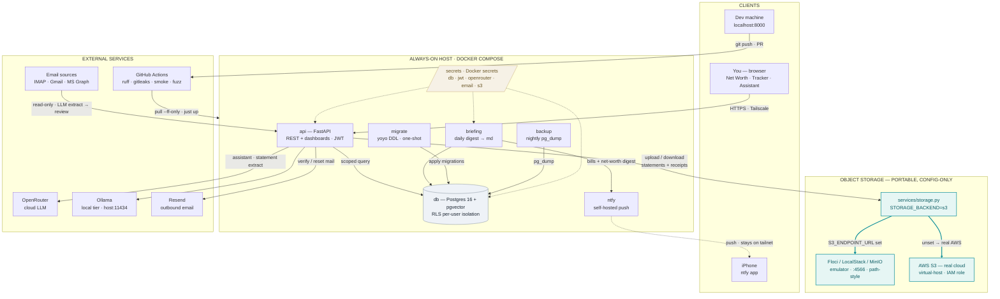
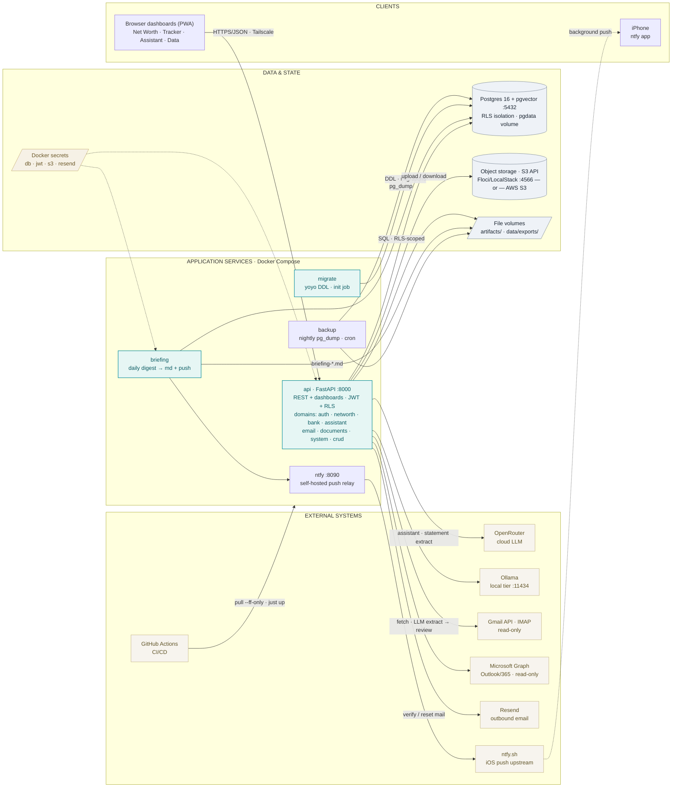

# Architecture

Two views of Aadyon Assist. GitHub renders the diagrams below inline; the same
content lives as standalone, editable sources you can open in mermaid.live, the VS Code
Mermaid extensions, or draw.io:

- High-level system map → [`architecture.mermaid`](../architecture.mermaid)
- Services / container detail → [`services-architecture.mermaid`](../services-architecture.mermaid)

> **Keep in sync:** the fenced blocks here mirror those two source files. When you edit a
> diagram, update both the `.mermaid` file and the matching block below.

---

## 1 · System map

Who talks to the API, the workers behind it, the portable storage seam, and the external
boundary. Teal marks the config-only storage switch (the thick teal fork is AWS ⇄ emulator);
dashed edges are secrets and push.

---

## 2 · Services & deployment (C4 container view)

Every deployable container, the state it owns, and the systems it depends on. **Honest framing:**
this is a *modular monolith with sidecar workers*, not independent microservices — `api`,
`briefing`, and `migrate` are the **same image** (`code/api/Dockerfile`) run with different
entrypoints; `ntfy` and `backup` are stock upstream images. Teal marks first-party services.

---

See also [`SYSTEM.md`](../SYSTEM.md) for the prose architecture, [`docs/CLOUD.md`](CLOUD.md) for the
managed-cloud migration path, and [`docs/cloud-storage.md`](cloud-storage.md) for the portable
object-storage details.
